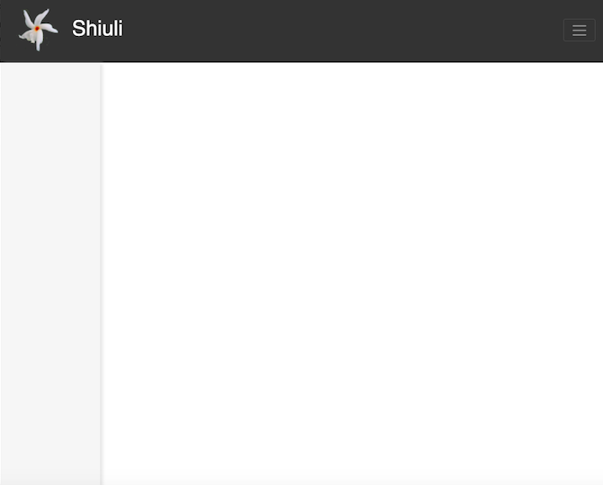

[](https://opensource.org/licenses/Apache-2.0) [![Build Status][travis-badge]][travis-badge-url]


**Shiuli** provides a simple configurable landing page for REST APIs. It's a collection 
of HTML, JavaScript, and CSS files packaged as a WebJars.

# Maven

The current version is `0.2.0`. To use Shiuli, add the following dependency to your `pom.xml.`

```xml
<dependency>
    <groupId>com.github.indrabasak</groupId>
    <artifactId>shiuli</artifactId>
    <version>0.2.0</version>
</dependency>
```
# Usage
Spring Boot picks up the content of a webjars if the jar is detected in the classpath. 
Please see the [webjar documentation](https://www.webjars.org/documentation#springboot) 
to find out more on how to configure a webjar with a Spring application.

The Shiuli landing page can be accessed at, `http://<host>:<port>/`

Here's the default look and feeling of the Shiuli landing page.



## Custom Configuration
You can custom configure the landing page by adding a file named `shiuli.json` 
located under the `static` folder, which is under the `resources` directory.

```
your-project
|__ src
    |__ main
       |__ java
       |__ resources
          |__ static
              |__ shiuli.json
```

The next few sections discuss ways to customize the landing page.

### Title 
The title can be customized by adding a `title` field in `shiuli.json`,
```json
{
  "title": "Shiuli Example"
}
```

### Logo
The logo can be customized by adding a `logo` field in `shiuli.json`,
```json
{
  "logo": "./images/logo.png"
}
``` 

### Message
The message is the content which shows up on the main viewing panel when you
first access the landing page. It can be configured in a couple of different
ways. If you want a simple text to show up, just add a `text` field. If you want
something elaborate, create a markdown page and specify the URL of the markdown
file in the `path` field. 

```json
{
  "message": {
    "text": "This is a simple text example.",
    "path": "welcome.md"
  }
}
```

### Menu
You can add links on the navigation bar adding items in the `menu` field.

```json
{
  "menu": [
    {
      "name": "Swagger",
      "endpoint": "swagger-ui.html",
      "type": "html",
      "embed": true
    },
    {
      "name": "NY Times",
      "endpoint": "https://www.nytimes.com",
      "type": "html",
      "embed": true
    }
  ]
}
```

  - `name`: It's used for giving a name the to the link which appears on 
  the nvaigation bar.
  - `endpoint`: It's used to specify the URL of the page you would like to 
  display. It can be relative or absolute.
  - `type`: It's used to specify the mime type of content, e.g., `json`, `html`, or `text`.
  It plays a role on how the content is rendered if it's in the main viewing 
  panel.
  - `embed`: If the value is `true`, the content of the URL specified in the
  `endpoint` field will be displayed in the main display panel. If it's `false`,
  the content will be displayed in a separate browser window or tab.
 
### Link
You can add links on the left panel by adding a link item in the `links` field.
A link item follow the same syntax as the menu item.

Here's a simple example of a `shiuli.json`,

```json
{
  "title": "Shiuli Example",
  "logo": "./images/logo.png",
  "message": {
    "text": "This is a Shiuli configured landing page of an example Spring Boot application.",
    "path": "welcome.md"
  },
  "menu": [
      {
        "name": "Swagger",
        "endpoint": "swagger-ui.html",
        "type": "html",
        "embed": true
      },
      {
        "name": "Metrics",
        "endpoint": "patra-ui.html",
        "type": "html",
        "embed": false
      }
  ],
  "links": [
      {
        "name": "Health",
        "endpoint": "health",
        "type": "json",
        "embed": true
      },
      {
        "name": "NPR",
        "endpoint": "https://www.npr.org/",
        "type": "html",
        "embed": false
      }
  ]
}
```

Here's an example of Shiuli landing page after customization,


# Build
* Check out the [project](https://github.com/indrabasak/shiuli).
* Execute the following Maven command from the parent directory:
```
mvn clean install
```
Once the build completes successfully, you should have `shiuli-1.0.0.jar` in the `shiuli/target` folder.

# Dependencies
Shiuli 1.0.0 depends on the following libraries:
1. [Bootstrap (4.5.0)](https://getbootstrap.com/) is a JavaScript library provides a collection HTML design templates. 
3. [jQuery (3.5.1)](http://jquery.com/) is a quintessential JavaScript library for manipulating HTML documents.
3. [Showdownjs (1.9.0)](http://showdownjs.com/) is a HTML converter for Markdown documents.

# License
The __Shiuli__ code is shared under the terms of [Apache License v2.0](https://opensource.org/licenses/Apache-2.0).

[travis-badge]: https://travis-ci.org/indrabasak/shiuli.svg?branch=master
[travis-badge-url]: https://travis-ci.org/indrabasak/shiuli

